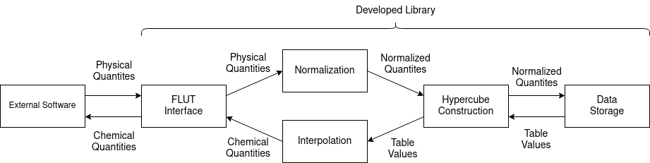
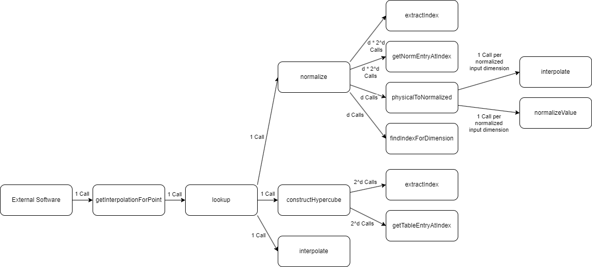

## Description
This C++ library is used for LUT (Look-Up Tables).  
It implements a lookup for normalized LUT with shared memory usage.

## Dependencies

| Dependency | Version | Notes |
|---|---|---|
| CMake | 3.20+ | |
| C++ compiler | C++20 | |
| HDF5 | C library + headers | Required by [HighFive](https://github.com/highfive-devs/highfive) to read/write the LUT's HDF5 format (see below). Not fetched automatically — must already be installed/loadable on your system. OpenFOAM installations commonly pull this in already, since OpenFOAM itself links HDF5. |
| [HighFive](https://github.com/highfive-devs/highfive) v3.2.0 | | Fetched automatically via CMake's `FetchContent` — no separate install needed. |

## Building

```bash
cmake -S . -B build
cmake --build build -j$(nproc)
cmake --install build
```

Pass `-DBUILD_WITH_TESTING=ON` to also build the test suite under `test/`.

This library is used standalone here, but within [OxySim-129](https://github.com/STFS-TUDa/oxysim-129) it's built automatically as a submodule (`add_subdirectory(extern/flut-reader)`), so you don't need to build it separately there.

## Project Folder Structure
The project consists of 6 folders.

- src
    - Contains the main implementations:
        - `containers.*`: Classes / Structs for the handling of the table data
        - `parser/*`: Available parsers to fill the data containers
        - `abstract_table.hpp`: abstract interface definition of the LUT
        - `lookup_table.*`: implementation of the abstract interface
        - `interpolator.*`: implementation of the ND interpolation
- test
    - contains testsuites for testing the library
- data
    - contains data files used for testing
- scripts
    - contains helpful scripts that are not a part of the library
- [flut_creation_demo](./flut_creation_demo/flamelet_demo.ipynb)
    - a worked example (`flamelet_demo.ipynb`) that builds a premixed-flamelet LUT with
      Cantera from scratch and writes it out in the HDF5 format described below, for use with
      [OxySim-129](https://github.com/STFS-TUDa/oxysim-129); see "Building a Lookup Table" below.
      Needs its own Python environment, per `flut_creation_demo/requirements.txt` (the notebook's
      own first cell documents how to set one up)
- doc
    - images referenced from this README (`doc/images/`)

## Building a Lookup Table (HDF5 format)
A LUT is a single HDF5 file. It can be built with any tool that writes HDF5 (the demo in
`flut_creation_demo/flamelet_demo.ipynb` builds one from scratch with Cantera + h5py, using the
helpers in `flut_creation_demo/h5_utilities.py`). This section documents the layout the C++ reader
(`src/parser/pyflut-hdf5-highfive.cpp`, `fileType = "pyflut"`) expects.

The file has three required top-level entries:

- **`/data`** — a single dense, rectilinear array of shape
  `(dim0_size, dim1_size, ..., dimN_size, n_outputs)`. The first N axes are the input dimensions,
  in the order given by each input variable's `Index` (see below); the last axis holds the output
  variables, in the order given by `/output_dict`. Only up to **6** input dimensions (N ≤ 6) are
  supported — `Interpolator::interpolate` throws for more.
- **`/output_dict`** — one scalar integer dataset per output variable, named after the variable,
  whose value is that variable's index into the last axis of `/data`. Indices must be a contiguous
  `0..n_outputs-1` range.
- **`/input_dict/<name>`** — one group per input dimension (`<name>` need not match the physical
  variable name the library exposes, see `Physical_name` below), each containing:
  - `Index` (int) — the axis of `/data` this dimension corresponds to (`0..N-1`).
  - `Values` (1D array) — the grid coordinates along this axis, strictly monotonically increasing.
    These are the values `lookup()` compares against, so if the dimension is normalized they must
    be given already in normalized space (e.g. `[0, 1]`), not physical units.
  - `Normalization_settings/Normalize` (bool) — whether this dimension is normalized. If `false`,
    `Values` and the corresponding entry of the input vector passed to `lookup()` are both in
    physical units, and no further settings are needed.
  - `Normalization_settings/Settings/*` (only if `Normalize` is `true`):
    - `Physical_name` (string) — the variable name exposed to callers via `getInputVariables()`
      and expected at this position in `lookup()`'s input vector, in **physical** (un-normalized)
      units. This can differ from `<name>`, e.g. group `Hnorm` → `Physical_name = "h"`.
    - `Normalization_type` (string) — `"default"` or `"variance"` (see below).

Two normalization types are implemented (`FLUT::Normalization` in `src/lookup_table.cpp`):

- **`"default"`** — min-max normalization, `xnorm = (x - xmin) / (xmax - xmin)`, clamped to
  `[0, 1]` outside the bounds. Requires two extra `Settings` entries, `Min_name_normalization` and
  `Max_name_normalization`, giving the names of two **output** variables (i.e. they must also
  exist in `/output_dict`/`/data`) that hold this dimension's lower/upper physical bound at each
  point of the *preceding* dimensions — these bounds are interpolated the same way as any other
  output before being used to normalize the input value. This allows the bounds to vary across the
  table (e.g. an enthalpy range that depends on mixture fraction), not just be a single global
  min/max.
- **`"variance"`** — scales a variance-like quantity by the maximum variance a `[0,1]`-bounded
  variable of a given mean can have: `xnorm = variance / (baseValue * (1 - baseValue))`, clamped to
  `[0, 1]`. Requires `Base_variable_name`, the `Physical_name` of another input variable in the
  same table; its *physical* value from the `lookup()` input vector is used as `baseValue`. In
  `data/06_testFLUT_PDF.h5`, the `Zvar_norm` dimension uses `Base_variable_name = "Z"` to normalize
  a mixture-fraction variance by `Z * (1 - Z)`.

`/metadata` and `/pyflut_settings` groups (arbitrary nested key-value data, see
`flut_creation_demo/h5_utilities.py:write_dictionary_to_hdf5`) are conventional but **not read by
the C++ parser** — they're for downstream tooling (e.g. a Python `pyflut` reader) or provenance,
not required by this library.

## Usage of the library
The library is designed to use the LookupTable via the interfaces defined in `abstract_table.hpp`.  
Some example functionalities are given below:
```c++
// Initialization
    // Initialization with all outputVariables in the table
    std::string pathToTable = "table.h5";
    std::vector<std::string> outputVariables = {};
    FLUT::LookupTable table(pathToTable, outputVariables, "pyflut");

    // Initialization with a subset of variables
    std::string pathToTable = "table.h5";
    std::vector<std::string> outputVariables = {"alpha", "T", "visc"};
    FLUT::LookupTable table(pathToTable, outputVariables, "pyflut");

    // Initialization and loading of output variable data separately
        // Initialize table
        std::string pathToTable = "table.h5";
        FLUT::LookupTable table(pathToTable);
        // Load outputVariables
        std::vector<std::string> outputVariables = {"alpha", "T", "visc"};
        table.readOutputVariableData(outputVariables);

// Perform lookup
std::vector<double> inputValues = {0.5, 0.4, 0.3};
std::vector<double> resultVector = table.lookup(inputValues);

// Retrieve information on LUT data
    // Get inputVariables
    std::vector<std::string> inputVariableNames = table.getInputVariables();
    // Get availableOutputVariables
    std::vector<std::string> outputVariableNames = table.getAvailableOutputVariables();
    // Get loadedOutputVariables
    std::vector<std::string> outputVariableNames = table.getLoadedOutputVariables();

// Print information of the table to commandLine
table.printInfo();

// Some additional functions for sanity checks
    // Checks if the outputVariable is inside 
    // the data and throws an error otherwise.
    table.containsOutputVariable("variableName")

```

## Memory Management
The `DataSharedMemory` defined in `src/containers.*` implements shared memory handling. In order to prevent memory duplication the data is loaded into a POSIX Shared Memory Object using [shm_open](https://man7.org/linux/man-pages/man3/shm_open.3.html) and then mapped into the virtual memory address of the process using this data via [mmap](https://man7.org/linux/man-pages/man2/mmap.2.html). The shared memory object can be viewed by listing the files under `/dev/shm`. The library automatically cleans the initialized shared memory object but if needed it can also be manually cleared by calling `rm` on it. 

## Data Flow
FLUT receives physical input quantities from an external software and calls the table implementation that is hardcoded into the code. The physical quantities that belong to a normalized input variable in the data table are normalized and the rest are passed as it is to the next step. Inside the hypercube construction values that surround the normalized quantities are selected from the data table and passed into interpolation. During the interpolation step a multivariate linear interpolation is applied to the points of the hypercube. The result of the interpolation is passed back to the external software.

<div align=center>

</div>

## Function Call Graph
The call graph below shows the function call hierarchy and amounts for Hdf5TableMemOpt. The graph is read using a depth first approach left to right and top to bottom. d is the amount of input dimensions.

<div align=center>

</div>

## Functions
A list of functions and short explanations that are implemented in the LookupTable class
- lookup
    - top level function that calls normalize, constructHypercube, interpolate
- findIndexForDimension
    - finds the first value greater than the input value
- getTableEntryAtIndex
    - gets the values for the requested outputs from the buffer corresponding to the indices given to the function
- interpolate
    - applies multivariate linear interpolation to the inputs
- constructHypercube
    - creates a hypercube to be used in interpolation
- normalize
    - calls physicalToNormalize for normalization and creates a vector of dimension bounds using the normalized values
- physicalToNormalized
    - if the input dimension is normalized calls normalizeValue, else returns the input value as is
- normalizeValue
    - normalizes the value and returns it
- extractIndex
    - generates an index of a hypercube
- getNormEntryAtIndex
    - retrieves the interval on which a value should be normalized, based on the previously calculated indices

## Developers
Informatics project: Adrian Schmidt, Berkehan Atikeler, Florian Magin, Gregor Carmesin, Sargon Malko
STFS improvements: Matthias Steinhausen
